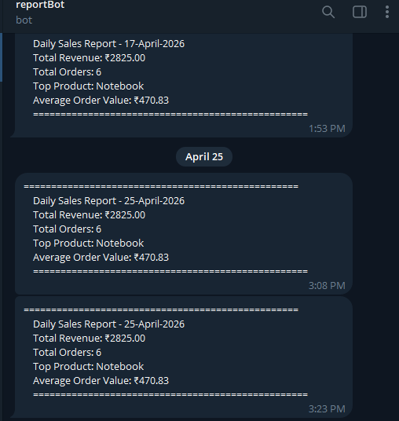

# Report Bot

This project reads sales data from a CSV file, checks the numbers, and sends a daily report to Telegram. Each file has one small job, so the code is easier to read and change.

## What It Does

- Reads sales data from a CSV file
- Calculates total revenue, top product, total orders, and average order value
- Builds a simple Telegram message
- Sends the message to Telegram

## Project Structure

```
report_bot/
├── data/
│   └── sales.csv          # Your sales data goes here
├── src/
│   ├── models.py          # Data blueprints (SaleRecord, ReportSummary)
│   ├── reader.py          # Reads CSV into SaleRecord objects
│   ├── analyzer.py        # Calculates totals and summaries
│   ├── formatter.py       # Formats the report message
│   ├── bot.py             # Sends message via Telegram API
│   └── scheduler.py       # Runs the pipeline on a daily schedule
├── config.py              # File paths and schedule settings
├── main.py                # Entry point
├── .env                   # Your secrets (never pushed to GitHub)
└── requirements.txt       # Dependencies
```

---

## Setup

### 1. Clone the repository

```bash
git clone https://github.com/be-harsh/report-bot.git
cd report-bot
```

### 2. Install dependencies

```bash
pip install -r requirements.txt
```

### 3. Create your `.env` file

Create a file named `.env` in the project root and add:

```
BOT_TOKEN=your_telegram_bot_token
CHAT_ID=your_telegram_chat_id
```

To get these values:
- **BOT_TOKEN** — Open Telegram, search `@BotFather`, send `/newbot`, follow the steps
- **CHAT_ID** — Search `@userinfobot` on Telegram, send any message, copy the ID it gives you

### 4. Add your sales data

Your `data/sales.csv` file should look like this:

```
date,product,quantity,price
2024-01-01,Notebook,5,120
2024-01-01,Pen,20,15
2024-01-02,Stapler,2,250
```

### 5. Set the schedule time

Open `config.py` and set the time you want:

```python
SCHEDULE_TIME = "09:00"
```

## Run

```bash
python main.py
```

This sends the report one time and then the program stops.

If you want to keep the Python scheduler running in the terminal, use:

```bash
python main.py --loop
```

## Sample Telegram Report



## Run Automatically on Windows

If you do not want to keep Python open all day, use Windows Task Scheduler:

- **Trigger:** Daily at your report time
- **Program:** path to your `python.exe`
- **Arguments:** `e:\path\to\report_bot\main.py`
- **Start in:** `e:\path\to\report_bot`

> Note: This works only when the computer is on. If you want the report to send even when the computer is off, host the bot on a VPS or cloud server.

## Tech Stack

- Python 3.10+
- `requests` — sends the Telegram API request
- `python-dotenv` — loads values from `.env`
- `schedule` — runs the Python loop scheduler
- Telegram Bot API

## Concepts Used

- OOP and dataclasses
- CSV file handling
- Generator functions
- Collections module (Counter)
- Logging
- Environment variables
- Type hints
- Error handling
- Project structure and separation of concerns

## Author

Built by [be-harsh](https://github.com/be-harsh)
